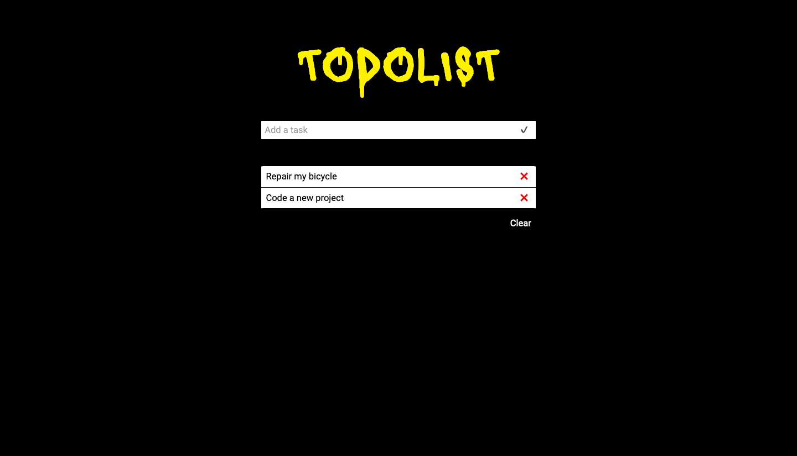

# simple-todolist

A simple todolist using React.JS

## Installation

Clone the repo.

`$ git clone https://github.com/Fedsam/todolist.git`

Intall dependencies.

`$ yarn install`

## Start

Launch app.

`$ yarn start`
